# Отчет по заданию D01_Linux-0.

Тема: Установка и обновления системы Linux. Основы администрирования.  
Выполнил: **kegsbett** (kegsbett@student.21-school.ru).

## Contents
  1.  [Установка ОС](#part-1-установка-ос)  
  2.  [Создание пользователя](#part-2-создание-пользователя)  
  3.  [Настройка сети ОС](#part-3-настройка-сети-ос)   
  4.  [Обновление ОС](#part-4-обновление-ос)  
  5.  [Использование команды sudo](#part-5-использование-команды-sudo)  
  6.  [Установка и настройка службы времени](#part-6-установка-и-настройка-службы-времени)  
  7.  [Установка и использование текстовых редакторов](#part-7-установка-и-использование-текстовых-редакторов)  
  8.  [Установка и базовая настройка сервиса SSHD](#part-8-установка-и-базовая-настройка-сервиса-sshd)   
  9.  [Установка и использование утилит top, htop](#part-9-установка-и-использование-утилит-top-htop)   
  10. [Использование утилиты fdisk](#part-10-использование-утилиты-fdisk)   
  11. [Использование утилиты df](#part-11-использование-утилиты-df)    
  12. [Использование утилиты du](#part-12-использование-утилиты-du)    
  13. [Установка и использование утилиты ncdu](#part-13-установка-и-использование-утилиты-ncdu)    
  14. [Работа с системными журналами](#part-14-работа-с-системными-журналами)     
  15. [Использование планировщика заданий CRON](#part-15-использование-планировщика-заданий-cron)    

## Part 1. Установка ОС

- Установлена *Ubuntu 20.04 Server LTS* без графического интерфейса.
- Результат выполнения команды `cat /etc/issue`:

## Part 2. Создание пользователя

- Создаем нового пользователя ***new_user*** с помощью следующей команды:
 \
Ключ `-g` задает основную группу пользователя.
- Новый пользователь виден в выводе команды `cat /etc/passwd`:

- Проверим причастность к группе adm `id new_user`:
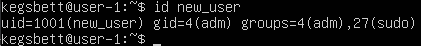

## Part 3. Настройка сети ОС

- Меняем имя машины на ***user-1***:
 \
Командой `sudo hostnamectl set-hostname user-1` устанавливаем имя машины в ***user-1***.  \
Перезагружаем и видим новое название машины.

- Устанавливаем временную зону, соответствующую текущему местоположению (***Europe/Moscow***):
Устанавливаем временную зону. \
 \
Проверяем временную зону. \
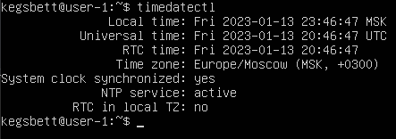

- Имена сетевых интерфейсов можно увидеть в выводе команды `ip link` в начале строки после порядкового номера с двоеточием: \
 \
Интерфейс `lo` (***loopback device***) – виртуальный интерфейс, присутствующий по умолчанию в любом Linux. \
Он используется для отладки сетевых программ и запуска серверных приложений на локальной машине.\
С этим интерфейсом всегда связан адрес 127.0.0.1. У него есть dns-имя – localhost. Посмотреть привязку можно в файле /etc/hosts.

- Используя команду `ip route`, получим ip адрес рабочего устройства, выданный DHCP:
 \
Из первой строки видно `proto dhcp src 172.26.4.52`, значит ip адрес устройства равен **172.26.4.52**. \
`DHCP` (***Dynamic Host Configuration Protocol***) — протокол прикладного уровня модели TCP/IP, служит для назначения IP-адреса клиенту. \
IP-адрес можно назначать вручную каждому клиенту, то есть компьютеру в локальной сети. Но в больших сетях это очень трудозатратно, к тому же, чем больше локальная сеть, тем выше возрастает вероятность ошибки при настройке. Поэтому для автоматизации назначения IP был создан протокол DHCP.

- Определим внешний ip-адрес шлюза - равен **172.26.0.0/20** и внутренний IP-адрес шлюза (gw) в строке - равен **172.26.0.1**

- Чтобы задать статические (заданные вручную, а не полученные от DHCP сервера) настройки ip, gw, dns, изменим содержимое файла `/etc/netplan/01-netcfg.yaml`.
Используем публичные DNS серверы 8.8.8.8 и 1.1.1.1. Поменяем текущий ip адрес на 172.26.0.0/20 и gw на 172.26.2.22. \
Изменим содержимое файла с помощью редактора *nano* командой `sudo nano /etc/netplan/01-netcfg.yaml`: \
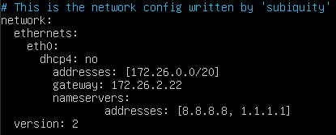 \
Чтобы применить изменения в файле, выполним команду `sudo netplan apply`.

- Перезагрузив систему командой `reboot`, убедимся, что статичные сетевые настройки (ip, gw, dns) соответствуют заданным в предыдущем пункте.
Проверим  ip и gw командой `ip route show`: \
 \
Проверим dns командой `resolvectl`: \

- В заключение пропингуем серверы **1.1.1.1** и **ya.ru**:

## Part 4. Обновление ОС

- Обновим систему с помощью команд `sudo apt update` и `sudo apt upgrade`.
- Введем повторно команду `sudo apt update` для проверки наличия обновлений:

## Part 5. Использование команды **sudo**

- `sudo` (англ. _**S**ubstitute **U**ser and **do**_, дословно «подменить пользователя и выполнить») — программа для системного администрирования UNIX-систем, позволяющая делегировать те или иные привилегированные ресурсы пользователям с ведением протокола работы.
Основная идея — дать пользователям как можно меньше прав, при этом достаточных для решения поставленных задач. \
Команда sudo предоставляет возможность пользователям выполнять команды от имени суперпользователя root, либо других пользователей. \
Правила, используемые sudo для принятия решения о предоставлении доступа, находятся в файле /etc/sudoers.

- Разрешим пользователю `new_user` выполнять команду `sudo`, добавив его в группу `sudo`:

- Поменяем hostname от имени пользователя **new_user**, используя `sudo`:
 \
После перезагрузки системы новое имя отображается в командной строке: \

## Part 6. Установка и настройка службы времени

- Запустим службу автоматической синхронизации времени:
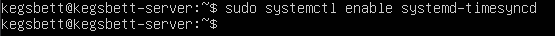
- Вывод команды `timedatectl show` содержит **NTPSynchronized=yes**:

## Part 7. Установка и использование текстовых редакторов 

- Установим текстовые редакторы **vim**, **nano** и **joe** и проверим, что они доступны для вызова:
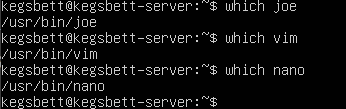

- Откроем файлы **test_vim.txt**, **test_nano.txt** и **test_joe.txt** на редактирование с помощью команд:
`vim test_vim.txt` \
`nano test_nano.txt` \
`joe test_joe.txt`

- Напишем слово **kegsbett** в каждом файле:
  - В редакторе *vim* это выглядит так:
   \
  Чтобы перейти в режим редактирования, нажмем клавишу [i]. Введем указанное слово. Чтобы перейти в режим ввода команд, сохранить файл и выйти из редактора, нажмем `[ESC]`, введем `:wq` и `[ENTER]`.

  - В редакторе *nano* это выглядит так:
  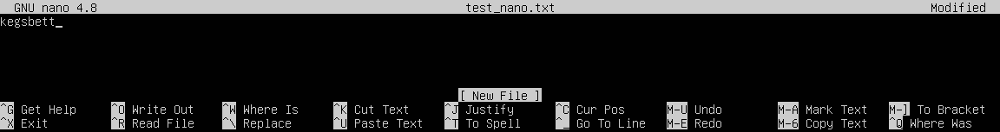 \
  После открытия файла на редактирование, можно сразу заполнять его текстом. Для сохранения файла после ввода нажимаем `[CTRL]+[o]`, `[ENTER]`. Для выхода из редактора нажимаем `[CTRL]+[x]`.

  - В редакторе *joe* это выглядит так:
   \
  После открытия файла на редактирование, можно сразу заполнять его текстом. Для выхода нужно сначала нажать `[CTRL]+[K]` (для перехода в командный режим), а затем нажать `[Q]`. Для сохранения изменений после этого нажать `[y]`.
\
- Проверим содержимое трех файлов после их сохранения:

- Снова откроем файлы на редактирование с помощью указанных выше команд.
Заменим слово **kegsbett** в каждом файле на **21 School 21**:
  - В редакторе *vim* это выглядит так:
  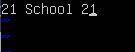 \
  Чтобы перейти в режим редактирования, в обычном режиме нажмем клавишу [a]. Изменим текст. Чтобы перейти в режим ввода команд и выйти из редактора без сохранения изменений, нажмем `[ESC]`, введем `:q!` и `[ENTER]`.

  - В редакторе *nano* это выглядит так:
   \
  После открытия файла на редактирование, можно сразу менять содержимое файла. Для выхода из редактора без сохранения изменений нажимаем `[CTRL]+[x]`, редактор предложит записать изменения. Для отказа нажимаем `[n]`.

  - В редакторе *joe* это выглядит так:
   \
  После открытия файла на редактирование, можно сразу менять его содержимое. Для выхода из редактора без сохранения изменений нажимаем `[CTRL]+[]`, редактор предложит сохранить изменения. Для отказа нажимаем `[n]`.
- Проверим содержимое трех файлов после последних манипуляций:

- Снова откроем файлы на редактирование с помощью указанных выше команд.
Заменим слово **kegsbett** в каждом файле на текст **hello** \
В каждом файле командами редактора будем искать все вхождения слова **kegsbett** и заменять их на **hello**:
  - Поиск слова в редакторе *vim* выглядит так:
   \
  Чтобы перейти в режим поиска, в обычном режиме нажмем клавишу `/`, затем введем искомое слово и нажмем `[ENTER]`. Для поиска следующего вхождения слова нажмем `n`. Для выхода из режима поиска нажмем [ESC]. \
  Поиск и замена всех вхождений слова выполняется в командном режиме с помощью команды `:%s/kegsbett/hello/g`, затем `[ENTER]`: \
   \
  После выполнения команды сохраним файл командой `:wq`.

  - Поиск слова редакторе *nano* выглядит так:
  Для поиска слова жмем `[CTRL]+[w]`, вводим искомое слово, жмем `[ENTER]`. \
   \
  Для поиска следующего вхождения слова нажмем опять `[CTRL]+[w]`, затем `[ENTER]`. \
  Для поиска и замены слова жмем `[CTRL]+[\]`, вводим искомое слово, жмем `[ENTER]`. \
   \
  Далее редактор запрашивает строку, на которую требуется заменить искомое слово, вводим ее и жмем `[ENTER]`: \
   \
  Далее редактор спрашивает, заменить ли найденное вхождение `[y]` или все вхождения `[a]`. Нажмем `[a]`: \
  После выполнения команды сохраним файл.

  - Поиск в редакторе *joe* выглядит так:
  После нажатия комбинации `[CTRL]+[K]`, а затем `[F]` и введем искомое слово, затем `[ENTER]`: \
   \
  Для поиска и замены всех вхождений слова перейдем в режим ввода команд, нажав `[CTRL]+[K]`,  а затем `[R]` и введем слово которое нужно заменить: \
  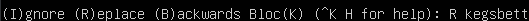 \
  Затем вводим имя на которое заменить: \
   \
  И соглашаемся, выбираем `[y]`: \
  

## Part 8. Установка и базовая настройка сервиса **SSHD**

- Установим **OpenSSH server**: \
Для установки SSHd необходимо установить openssh-server с помощью команды \
`sudo apt install openssh-server`

- Добавим автостарт службы при загрузке системы: \

- Чтобы перенастроить службу SSHd на порт 2022, изменим конфигурационный файл командой `sudo vim /etc/ssh/sshd_config`: \
Заменим строку **#Port 22** строкой **Port 2022** и сохраним файл: \

- Используя команду `ps -A | grep sshd`, показажем наличие процесса sshd среди запущенных процессов. \
Ключ `-A` заставляет утилиту ***показать все процессы***, далее по ним производим поиск строк на наличие процесса с подстрокой **sshd**: \

- Перезагрузим систему и выполним команду `netstat -tan`. \
Заметим, что вывод команды содержит строку `tcp6 0 0 :::2022 :::* LISTEN`: \
 \
Ключ `-a` показывает все (как прослушиваемые, так непрослушиваемые) сокеты системы; \
ключ `-t` из активных интернет-соединений выделяет только протокол TCP, который используется сокетами; \
ключ `-n` заставляет утилиту выводить адреса в числовом формате, разделенные точками, вместо использования символических сетевых имен.

## Part 9. Установка и использование утилит **top**, **htop**

- Утилиты **top** и **htop** установлены: \

- Запуск команды `top` дает следующую картину: \
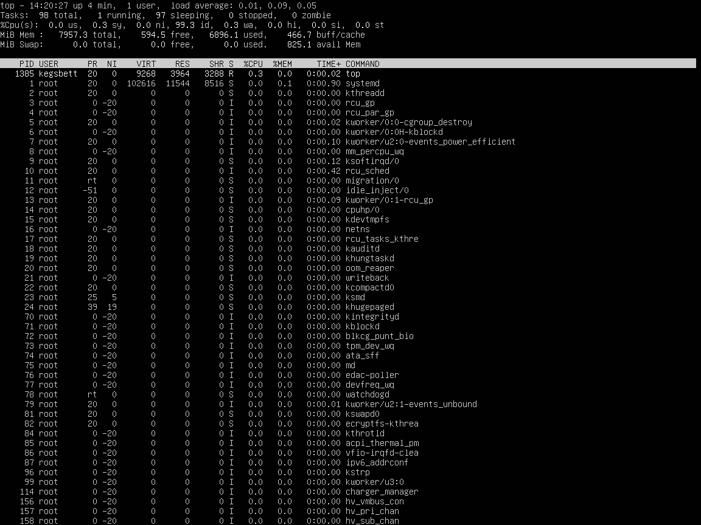

  - uptime: _4 минут_
  - количество авторизованных пользователей: _1_
  - общая загрузка системы: _0.01 - за последнюю мнуту, 0.09 - за последние 5 минут, 0.05 - за последние 15 минут_
  - общее количество процессов: _98_
  - загрузка cpu: \
  _0.0% для работающих пользовательских процессов с неизмененным приоритетом (un-niced, nice value = 0);_ \
  _0.3% для работающих системных процессов;_ \
  _0.0% для работающих пользовательских процессов с измененным приоритетом (niced, nice value != 0)_
  - загрузка памяти: _6896.1МБ из 7957.3МБ_
  - pid процесса занимающего больше всего памяти: _696_ \
  
  - pid процесса, занимающего больше всего процессорного времени: _1385_ \
  

- Запустим `htop` и отсортируем по
    - PID: \
    
    - PERCENT_CPU: \
    
    - PERCENT_MEM: \
    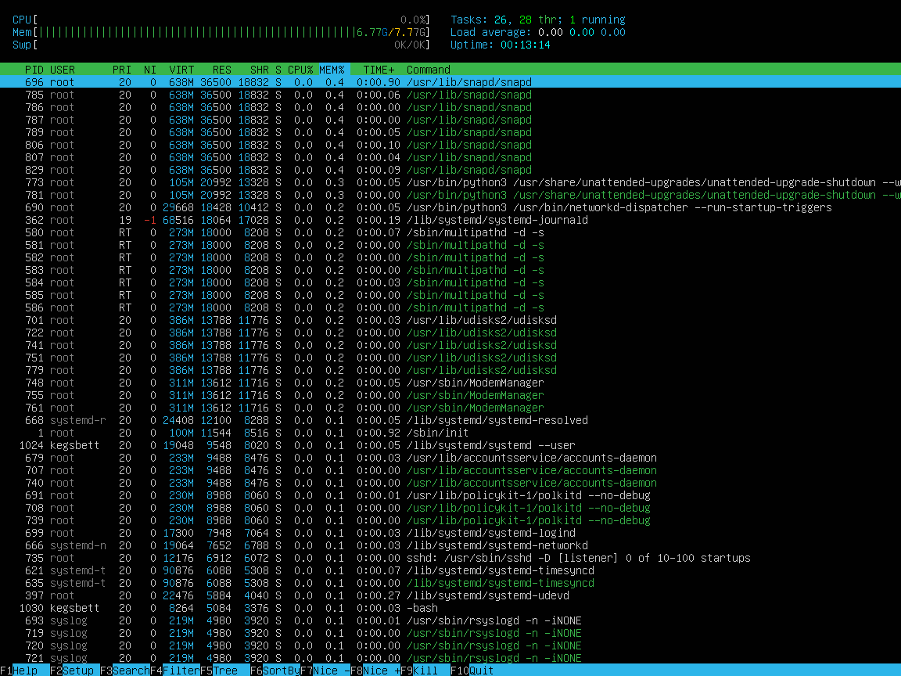
    - TIME: \
    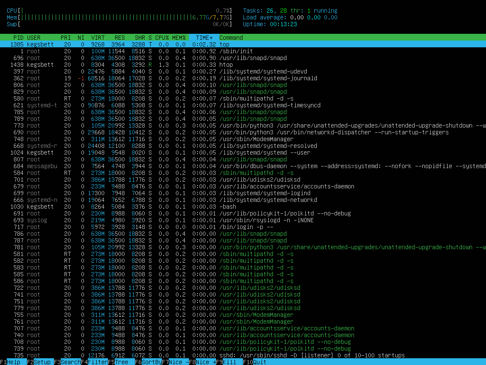
  - Отфильтруем для процесса **sshd**: \
  
  - Найдем процесс **syslog**: \
  
  - Добавим в правый столбец вывод **hostname**, **clock** и **uptime**: \
   

## Part 10. Использование утилиты **fdisk**

- Вывод команды `fdisk -l` (ключ `-l` выдает список таблиц разделов устройства): \

  - Название жесткого диска: _Virtual Disk_
  - Размер жесткого диска: _25ГБ_
  - Количество секторов: _52428800 (по 512 байт каждый)_
  - Раздела подкачки (**swap**) нет. \
   \

## Part 11. Использование утилиты **df** 

- Результат команды `df` (*disk free*): \
 \
Команда `df` без ключей выводит данные в килобайтах. \
Распишем результат, например, для корневого раздела (**/**):
  - размер раздела: _11218472КБ_
  - размер занятого пространства: _2849632КБ_
  - размер свободного пространства: _7777176КБ_
  - процент использования: _27%_ 

- Результат команды `df -Th`: \
 \
Ключ `-T` выводит тип файловой системы разделов, а ключ `-h` выводит данные в виде, удобном для человеческого восприятия. \
Распишем результат для корневого раздела (**/**):
    - размер раздела: _11ГБ_
    - размер занятого пространства: _2.8ГБ_
    - размер свободного пространства: _7.5ГБ_
    - процент использования: _27%_
    - тип файловой системы раздела: _ext4_

## Part 12. Использование утилиты **du**

- Результат работы команду `du`: \
 \
Флаг `-b` выводит реальный размер байтах, а флаг `-B 1` выводит размер в байтах, который аргумент занимает в памяти компьютера, разбитой на блоки. \
Флаг `-h` - в виде, удобном для человеческого восприятия. \
Флаг `-s` выводит общий размер каталога. \
Выведем размер папок /home, /var, /var/log:
    в байтах: \
  
    в человекочитаемом виде: \
  

- Выведем размер всего содержимого в **/var/log** (не общее, а каждого вложенного элемента, используя *): \
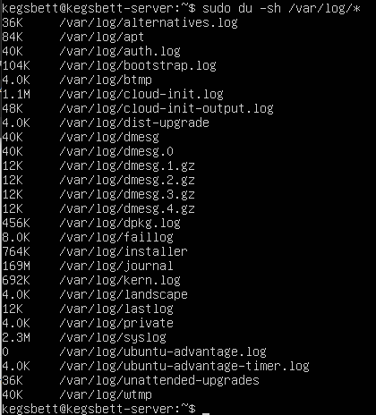

## Part 13. Установка и использование утилиты **ncdu**

- Установим утилиту **ncdu** командой `sudo apt install ncdu`. В результате утилита установлена: \
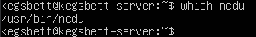
- Выведем размер папки **/home** следующей командой: \
 \
- Выведем размер папки **/var** следующей командой: \
 \
- Выведем размер папки **/var/log** следующей командой: \
 \
Заметим, что размеры каталогов примерно совпадают с полученными в предыдущей части работы.

## Part 14. Работа с системными журналами

**/var/log/dmesg** - буфер сообщения ядра, так называемый kernel ring buffer. \
Основная причина существования этого буфера - надо сохранить сообщения, которые возникают во время загрузки системы пока сервис syslog ещё не запущен и не может их собирать. Одноименной командой можно просмотреть вывод содержимого файла. \
Откроем для просмотра файл **/var/log/dmesg** с помощью команды `tail -n 10 /var/log/dmesg`: \
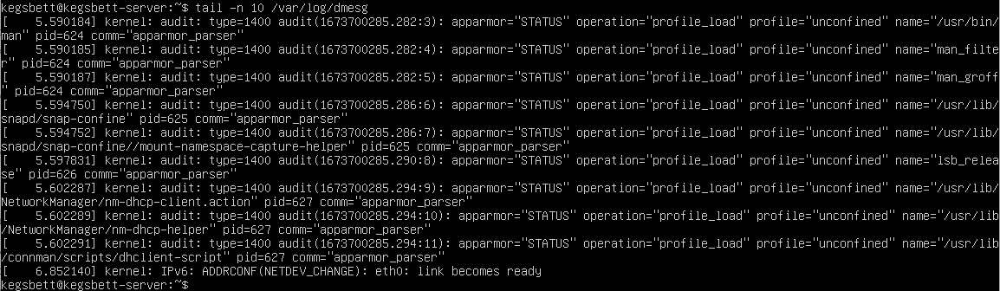

**/var/log/syslog** содержит глобальный системный журнал, в котором пишутся сообщения с момента запуска системы, от ядра Linux, различных служб, обнаруженных устройствах, сетевых интерфейсов и много другого. \
Откроем для просмотра файл **/var/log/syslog** с помощью команды `tail -n 10 /var/log/syslog`: \
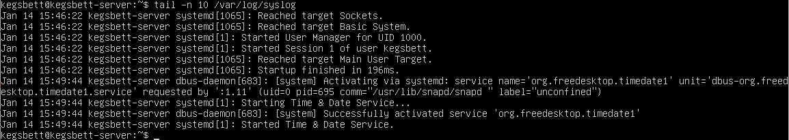

**/var/log/auth.log** содержит информацию об авторизации пользователей, включая удачные и неудачные попытки входа в систему, а также задействованные механизмы аутентификации. \
Откроем для просмотра файл **/var/log/auth.log** с помощью команды `tail -n 10 /var/log/auth.log`: \
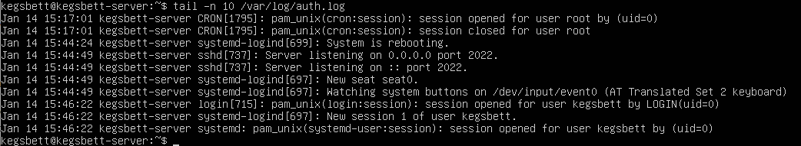 

- Найдем в журнале **/var/log/auth.log** время последней успешной авторизации, имя пользователя и метод входа в систему: \
Итак, время последней авторизации: 14 января 15:46:22; имя пользователя: kegsbett; метод входа в систему: LOGIN \

- Перезапустим службу SSHd командой `sudo systectl restart ssh` и найдем сообщения о перезапуске службы в записях журнала **/var/log/syslog**: \
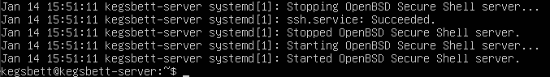 \

## Part 15. Использование планировщика заданий **CRON**

Используя планировщик заданий, запустим команду uptime на выполнение каждые 2 минуты. \
Для этого воспользуемся утилитой управления заданиями планировщика **crontab**.
- Выведем список текущих заданий для **CRON**: \
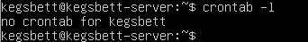
- Чтобы создать задание, выполним следующие действия и выберем редактор nano: \
 \
Это откроет файл настройки задания, добавим строку `*/2 * * * * uptime` для создания задачи и сохраним файл: \

- После сохранения файла выведем еще раз список текущих заданий для **CRON**: \
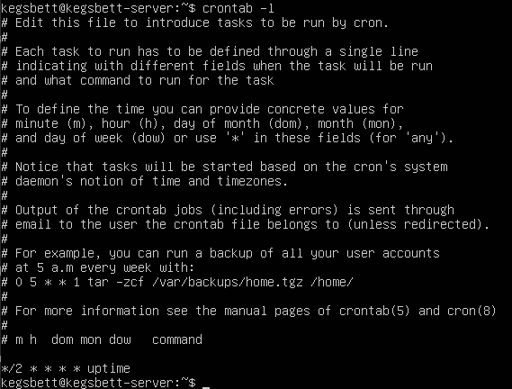
- Спустя некоторое время найдем в системном журнале **/var/log/syslog** строчки о выполнении задачи каждые 2 минуты: \

- Удалим все задания из планировщика заданий, затем выведем список текущих заданий: \

