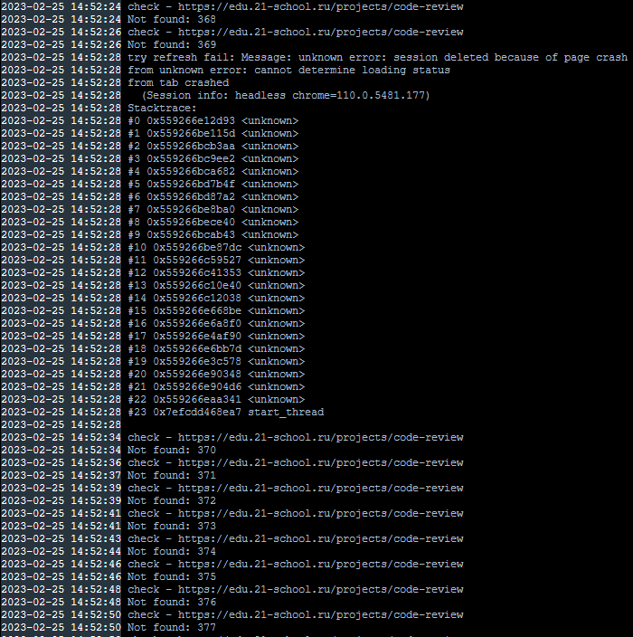

## Кастомный проект

Проект нужен чтобы отследить объект который появляется периодами.
В данном проекте происходит авторизация по заданным после редиректа на нужнуый сайт.
Далее selenium ищет по **XPATH** **span** где написано **Available**. И отправляет через телеграм бота уведомление с заданным текстом. 

В данной сборке он будет присылать уведомление все время пока доступен **span** где написано **Available**. Если нужно можно изменить до первого вхождения раскомментив **42 линию** в файле `nikita.py`

Для сборки и запуска контейнера можно воспользоваться командами:
`docker build -t parser:0.1 .`
`docker run -dit --name parser_cont parser:0.1`

В данном коде по какой-то причине после **find_element** иногда теряется подключение если не найден **span**. Поэтому есть доп **try** для отлова этой ситуации.
И подключение задается заново

