# Simple Docker

Введение в докер. Разработка простого докер образа для собственного сервера.

## Contents
  1. [Готовый докер](#part-1-готовый-докер)
  2. [Операции с контейнером](#part-2-операции-с-контейнером)
  3. [Мини веб-сервер](#part-3-мини-веб-сервер)
  4. [Свой докер](#part-4-свой-докер)
  5. [Dockle](#part-5-dockle)
  6. [Базовый Docker Compose](#part-6-базовый-docker-compose)

## Part 1. Готовый докер

В качестве конечной цели своей небольшой практики вы сразу выбрали написание докер образа для собственного веб сервера, а потому в начале вам нужно разобраться с уже готовым докер образом для сервера.
Ваш выбор пал на довольно простой **nginx**.

##### Возьмем официальный докер образ с **nginx** и выкачаем его при помощи
`docker pull nginx` \

##### Проверим наличие докер образа через `docker images`

##### Запустим докер образ через `docker run -d nginx`

##### Проверим, что образ запустился через `docker ps`

##### Посмотрим информацию о контейнере через `docker inspect container_id`
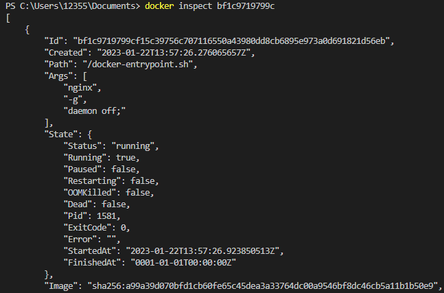
##### По выводу команды определим размер контейнера, список замапленных портов и ip контейнера
ShmSize \
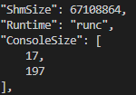 \
Port: 80 \
IP 172.17.0.2 \
 \
`docker ps -as` \
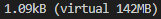
##### Остановим докер образ через `docker stop container_name`

##### Проверим, что образ остановился через `docker ps`
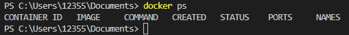
##### Запустим докер с замапленными портами 80 и 443 на локальную машину через команду:
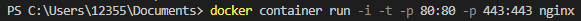
##### Проверим, что в браузере по адресу *localhost:80* доступна стартовая страница **nginx**
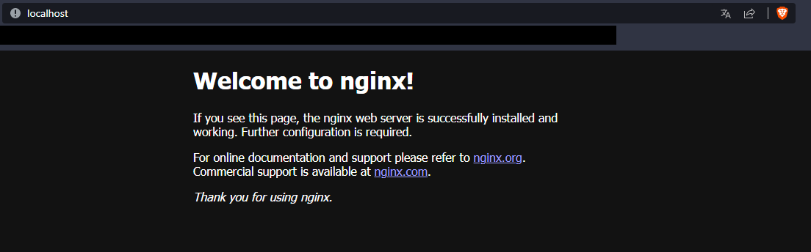
##### Перезапустим докер контейнер через `docker restart container_id`
##### Проверим что контейнер запустился
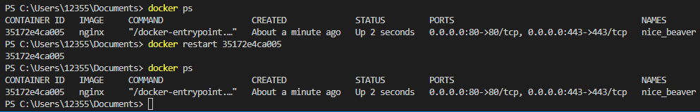

## Part 2. Операции с контейнером

Докер образ и контейнер готовы. Теперь можно покопаться в конфигурации **nginx** и отобразить статус страницы.

##### Прочитаем конфигурационный файл *nginx.conf* внутри докер контейнера через команду *exec*
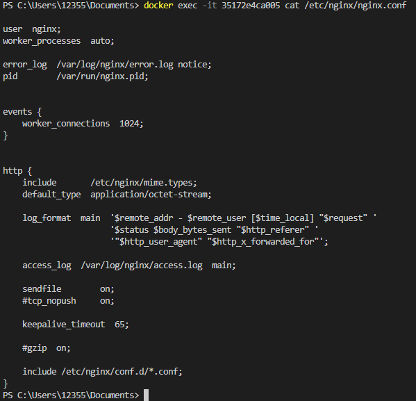
##### Создадим на локальной машине файл *nginx.conf* и настроим в нем по пути */status* отдачу страницы статуса сервера **nginx**

##### Скопируем созданный файл *nginx.conf* внутрь докер образа через команду `docker cp`
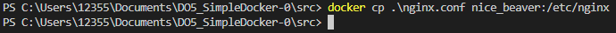
##### Перезапустим **nginx** внутри докер образа через команду *exec*

##### Проверим, что по адресу *localhost:80/status* отдается страничка со статусом сервера **nginx**
Браузер: \
 \
Curl: \
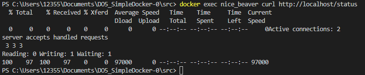
##### Экспортируем контейнер в файл *container.tar* через команду *export*
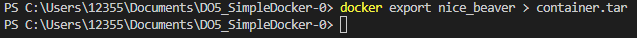
##### Остановим контейнер
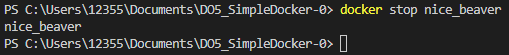
##### Удалим образ через `docker rmi repository`, не удаляя перед этим контейнер

##### Удалим остановленный контейнер

##### Импортируем контейнер обратно через команду *import*

##### Запустим импортированный контейнер

##### Проверим, что по адресу *localhost:80/status* отдается страничка со статусом сервера **nginx** командой curl:
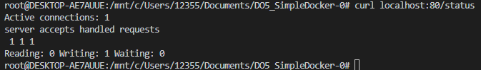

## Part 3. Мини веб-сервер

Настало время немного оторваться от докера, чтобы подготовиться к последнему этапу. Настало время написать свой сервер.

##### Напишем мини сервер на **C** и **FastCgi**, который будет возвращать простейшую страничку с надписью `Hello World!`
Установим нужные пакеты \
`sudo apt-get install libfcgi-dev` \
`sudo apt-get install spawn-fcgi`
##### Запустим написанный мини сервер через *spawn-fcgi* на порту 8080
`gcc fast_cgi.c -lfcgi -o hello` \
`spawn-fcgi -a 127.0.0.1 -p 8080 -f -n hello`
##### Напишем свой *nginx.conf*, который будет проксировать все запросы с 81 порта на *127.0.0.1:8080*

##### Проверим, что в браузере по *localhost:81* отдается написанная нами страничка
Curl: \
 \
Браузер: \
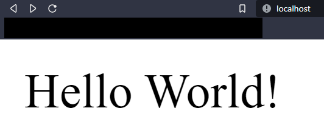

## Part 4. Свой докер

Теперь всё готово. Можно приступать к написанию докер образа для созданного сервера.

#### Напишем свой докер образ, который:
##### 1) собирает исходники мини сервера на FastCgi из [Части 3](#part-3-мини-веб-сервер)
##### 2) запускает его на 8080 порту
##### 3) копирует внутрь образа написанный *./nginx/nginx.conf*
##### 4) запускает **nginx**.
Dockerfile: \
 \
main.sh: \

##### Соберем написанный докер образ через `docker build -t mod-nginx-fcgi:0.1 .`
##### Проверим через `docker images`, что все собралось корректно

##### Запустим собранный докер образ с маппингом 81 порта на 80 на локальной машине и маппингом папки *./nginx* внутрь контейнера по адресу, где лежат конфигурационные файлы **nginx**'а командой:
`docker run -d -p 80:81 mod-nginx-fcgi:0.1`
##### Проверим, что по localhost:80 доступна страничка написанного мини сервера
Браузер: \

##### Допишем в *./nginx/nginx.conf* проксирование странички */status*, по которой надо отдавать статус сервера **nginx**
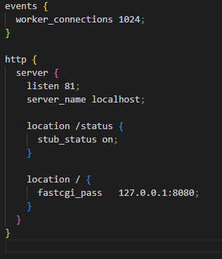
##### Перезапустим докер образ

##### Приверим, что теперь по *localhost:80/status* отдается страничка со статусом **nginx**
Браузер: \

## Part 5. **Dockle**

После написания образа никогда не будет лишним проверить его на безопасность.

##### Просканируем образ из предыдущего задания через `dockle -ak NGINX_GPGKEY mod-nginx-fcgi:0.1`

##### Исправим образ так, чтобы при проверке через **dockle** не было ошибок и предупреждений
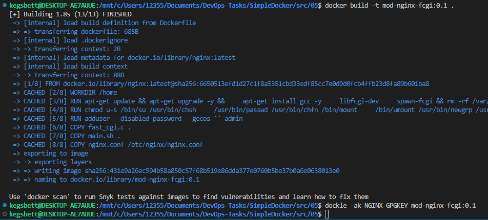

## Part 6. Базовый **Docker Compose**

Вот вы и закончили вашу разминку. А хотя погодите...
Почему бы не поэкспериментировать с развёртыванием проекта, состоящего сразу из нескольких докер образов?

##### Напишем файл *docker-compose.yml*, с помощью которого:
##### 1) Поднимем докер контейнер из [Части 5](#part-5-инструмент-dockle)
##### 2) Поднимем докер контейнер с **nginx**, который будет проксировать все запросы с 8080 порта на 81 порт первого контейнера
##### Замапим 8080 порт второго контейнера на 80 порт локальной машины
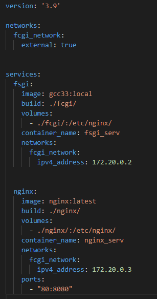

##### Остановим все запущенные контейнеры и соберем проект с помощью команды `docker-compose build` 

##### Запустим проект с помощью команды `docker-compose up`
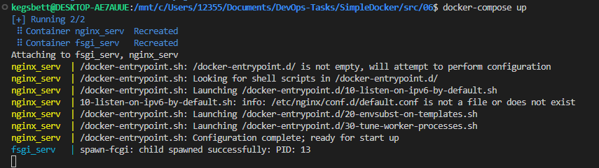
##### И проверим, что в браузере по *localhost:80* отдается написанная нами страничка, как и ранее
Curl: \

